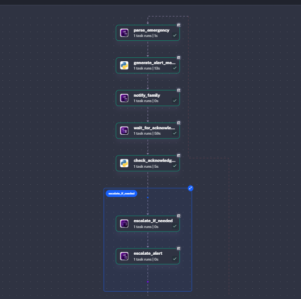
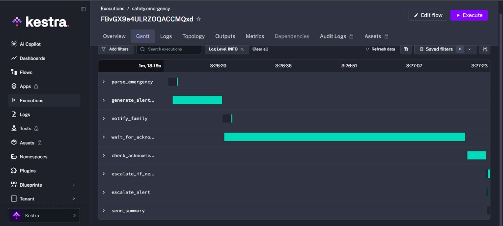
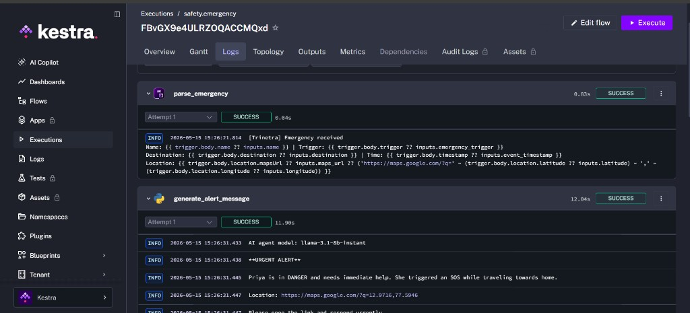
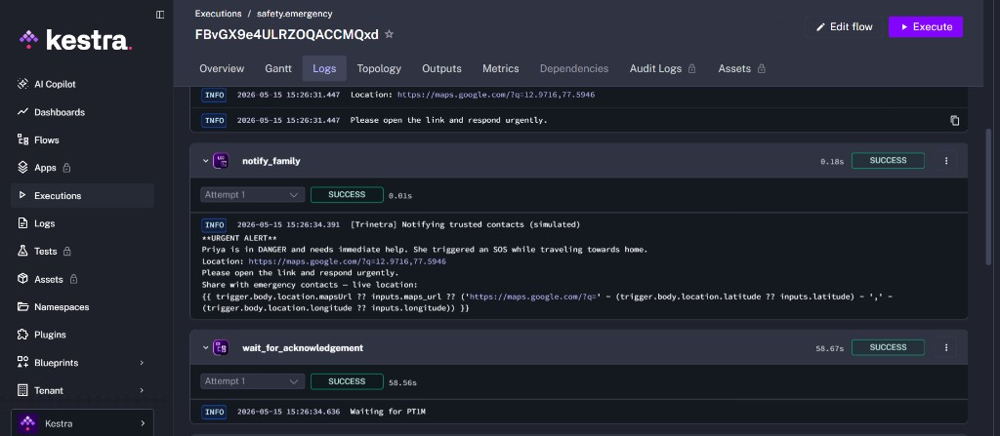
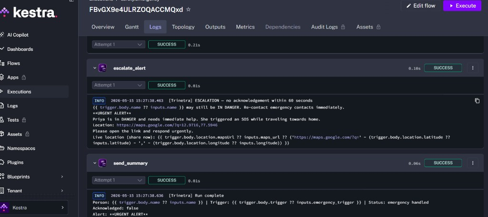

# Trinetra

**Trinetra** (त्रिनेत्र — “three-eyed”) is a women’s safety workflow on [Kestra](https://kestra.io). If someone cannot use their phone, it still alerts trusted contacts with an **urgent message** and **live location**.

> **Prerequisites:** [Docker](https://docs.docker.com/get-docker/) and a free [Groq API key](https://console.groq.com/keys). Jump to [Quick start](#quick-start).

---

## Why I built this

My sister works **night shifts** and often travels home alone. In a stressful moment she may not be able to unlock her phone and tap SOS.

Trinetra starts help **automatically**: a signal triggers a workflow that alerts family, shares location, waits **60 seconds**, then **escalates** (sends a stronger reminder) if nobody confirms they are helping.

---

## How it works

One Kestra flow runs **7 steps**. A full run takes about **70 seconds** (mostly the 60s wait for family to respond).

| Step | What happens |
|------|----------------|
| 1 | Read who needs help, what happened, and where they are |
| 2 | AI writes an urgent message + Google Maps link |
| 3 | Send alert to trusted contacts (logged in the demo) |
| 4 | Wait 60 seconds for a response |
| 5 | Check if family acknowledged |
| 6 | If no response → send a second, stronger reminder |
| 7 | Log final status |

### Flow diagram

**Visual flowchart** (from Kestra Topology after a successful run):




## Architecture Diagram

<p align="center">
  
</p>


| Kestra task | Step |
|-------------|------|
| `parse_emergency` | 1 |
| `generate_alert_message` | 2 |
| `notify_family` | 3 |
| `wait_for_acknowledgement` | 4 |
| `check_acknowledgement_status` | 5 |
| `escalate_if_needed` | 6 (only if no response) |
| `send_summary` | 7 |

### Triggers

| Trigger | When it fires |
|---------|----------------|
| `timeout` | Safe arrival not confirmed in time |
| `voice` | Distress phrase detected |
| `sos` | SOS button pressed |
| `watch` | Fall or abnormal vitals on a wearable |

---

## Execution walkthrough

After [running the demo](#quick-start), open **Executions** → your run → follow steps 1–5 below.

| Step | Image | Where in Kestra |
|------|-------|-----------------|
| 1 | `01-flow-topology.png` | **Topology** |
| 2 | `02-gantt-success.png` | **Gantt** |
| 3 | `03-ai-agent-alert-log.png` | `generate_alert_message` → **Logs** |
| 4 | `04-notify-family-log.png` | `notify_family` → **Logs** |
| 5 | `05-escalation-and-summary-log.png` | `escalate_alert` / `send_summary` → **Logs** |

---

### Step 1 — Full pipeline


Every task from trigger to summary, with green checkmarks when successful. Read top to bottom: parse → AI alert → notify → wait → check → optional escalation → summary.

---

### Step 2 — Timing (Gantt)



Shows how long each task took. The **60-second wait** should be the longest bar. AI generation is usually **10–15 seconds**. Other steps are quick.

---

### Step 3 — AI urgent alert



Groq writes the alert text. Look for **URGENT**, the trigger type (`voice`, `sos`, etc.), and a **Google Maps URL**. This message is reused in Steps 4 and 5 if needed.

Requires `GROQ_API_KEY` in Kestra KV Store (namespace `safety`).

---

### Step 4 — Notify family (first alert)



**First contact attempt:** family receives the urgent message and live location. In production, replace the log with SMS, push, or WhatsApp. The flow then waits 60 seconds.

---

### Step 5 — Escalation and summary



If nobody responded within 60 seconds, you see `ESCALATION — no acknowledgement within 60 seconds` (**second reminder**). The summary shows `Acknowledged: false` — **normal in a default demo run**.

---

## Stack

| Tool | Role |
|------|------|
| [Kestra](https://kestra.io) | Workflow engine (wait, branch, webhook) |
| Groq | AI alert text |
| Docker | Local Kestra + Postgres |
| Python | Tasks in `flows/trinetra.yml` |

---

## Quick start

**1. Start Kestra**

```bash
cd trinetra
docker compose up -d
```

Open **http://localhost:8080** — login: `admin@kestra.io` / `Admin1234!`

**2. Import flow** — namespace `safety`, id `emergency`, paste `flows/trinetra.yml` → Save

**3. API key** — **KV Store** (namespace `safety`) → add `GROQ_API_KEY` from [console.groq.com/keys](https://console.groq.com/keys)

**4. Run** — flow **safety / emergency** → **Execute** (defaults) → wait ~70s → check **Executions** against [screenshots](#screenshots-walkthrough)

**5. Webhook (optional)**

```bash
curl -X POST "http://localhost:8080/api/v1/main/executions/webhook/safety/emergency/emergency" \
  -H "Content-Type: application/json" \
  -u "admin@kestra.io:Admin1234!" \
  -d @sample-payloads/voice.json
```

---

## Sample payload

```json
{
  "name": "User",
  "destination": "Home",
  "trigger": "voice",
  "location": {
    "latitude": 12.9716,
    "longitude": 77.5946,
    "mapsUrl": "https://maps.google.com/?q=12.9716,77.5946"
  },
  "timestamp": "2026-05-14T23:15:00Z"
}
```

More samples: `sample-payloads/sos.json`, `timeout.json`, `watch.json`

---

## Configuration

| Item | Value |
|------|--------|
| Namespace | `safety` |
| Flow ID | `emergency` |
| Webhook | `http://localhost:8080/api/v1/main/executions/webhook/safety/emergency/emergency` |
| Required KV | `GROQ_API_KEY` |
| Optional KV | `TRINETRA_SIMULATE_ACK` = `true` |

---

## Troubleshooting

| Problem | Fix |
|---------|-----|
| Mermaid error in preview | Use the **Topology screenshot** above; the text `graph TD` diagram is a backup |
| Images not in README preview | Open `trinetra/README.md`; enable `markdown.preview.securityLevel: allowLocalImages` |
| Port 8080 down | `docker compose down -v && docker compose up -d` |
| AI task fails | Add `GROQ_API_KEY`; keep Docker running |
| Always see escalation | Expected in demo; set `TRINETRA_SIMULATE_ACK=true` to test skip path |

---

## License

MIT
